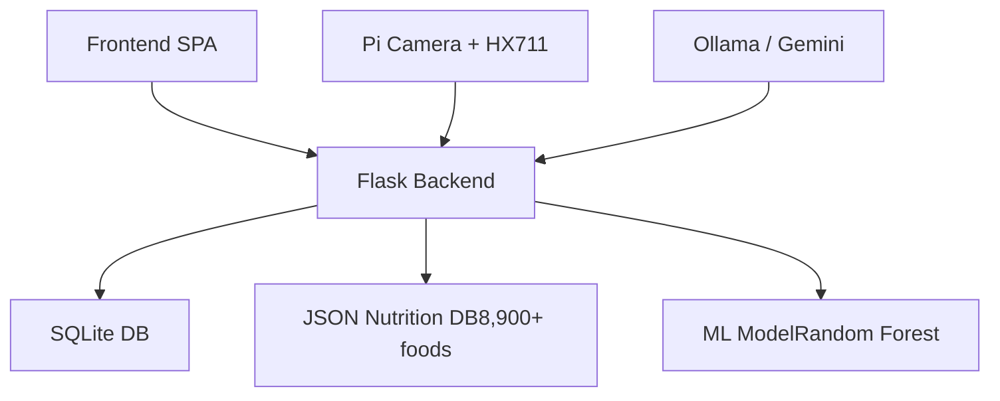
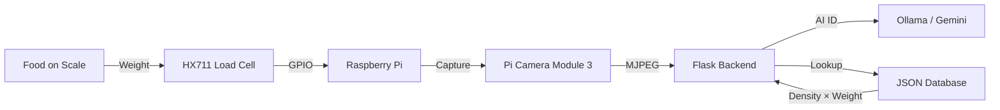

# NutriScale

An AIoT meal tracking system combining computer vision food identification,
precision weight measurement, and ML-driven health scoring. Operates in
standalone mode (software only) or IoT mode (Raspberry Pi + hardware sensors).

## Problem Statement

Manual dietary logging is tedious and leads to abandonment within weeks.
Existing camera-based "snap and log" apps cannot estimate portions without
a reference object, and rely on user-reported nutritional databases of
inconsistent accuracy. NutriScale addresses portion estimation through direct
weight measurement and food identification through vision AI grounded in a
trusted local nutrition database — separating the identification step (AI)
from the nutritional values step (authoritative local database).

## System Overview

In IoT mode, a Raspberry Pi with Pi Camera Module 3 and HX711 load cell
captures both the weight and an image of the food. The vision model (Ollama
LLaVA or Google Gemini) identifies the food item. A local database of 8,900+
foods provides trusted nutritional density per 100g. Calories and macros are
calculated as `(density per 100g) × (measured weight)`. In standalone mode,
users manually select foods or use AI identification without weight data.

## Architecture



## Hardware Interaction



## Technical Stack

| Layer | Technology | Rationale |
|---|---|---|
| Backend | Flask + SQLAlchemy | Lightweight, Python-native |
| Database | SQLite | Zero-config, portable, no server required |
| ML | scikit-learn RandomForest | Interpretable, fast inference |
| AI Vision | Ollama (LLaVA) / Gemini | Local-first food identification |
| Hardware | Raspberry Pi 5 + GPIO | Well-documented, ubiquitous |
| Sensors | HX711 + Pi Camera 3 | 24-bit ADC, 5kg max load |
| Frontend | Vanilla JS + PWA | No framework overhead |

## Key Engineering Features

**Vision-Grounded Identification:** The AI identifies the food item but
nutritional values always come from the local database. This prevents
hallucinated nutritional values from affecting logged data. The formula is
always: `(trusted density per 100g) × (measured weight in grams)`.

**Mock Hardware Mode:** Development and demonstration work without physical
hardware. `MockScaleService` simulates weight readings; `MockCameraService`
generates placeholder images. This enables full development and testing on
any platform without a Raspberry Pi.

**Ultra-Processed Food Detection:** The nutrition database flags ultra-processed
foods using NOVA classification. The health score automatically penalises UPF
consumption without requiring user input.

**AMDR-Aware Scoring:** Health score thresholds adapt to user goals. A user
targeting weight loss receives different scoring than one building muscle,
based on Acceptable Macronutrient Distribution Ranges.

**Dual-Mode Operation:** A single codebase handles both IoT mode (Pi + sensors)
and standalone mode (any PC). Hardware availability is detected at startup;
missing hardware falls back to mock services automatically.

## Machine Learning

> **Note:** Health score labels were generated via a deterministic heuristic
> formula, not clinical outcomes. The model learns to replicate the heuristic.
> Reported metrics reflect formula replication accuracy, not real-world health
> prediction accuracy.

**Dataset:** 9,000 synthetic daily logs across 150 simulated users (60 days each)

**Features (13 total):**

| Type | Features |
|---|---|
| Raw | total_calories, total_protein, total_carbs, total_fat, sugar, fiber, sodium |
| Engineered | p_pct, f_pct, c_pct (macronutrient % of total calories) |
| Density | fiber_density, sugar_density, sodium_density (per 1,000 kcal) |

**Ground truth formula:**
base = 9.0
penalties: fat >40% energy (−3.0), protein <12% (−2.5), sugar >60g (−2.0)
rewards: fiber >30g (+1.0), calorie deficit within range (+adjustment)
noise: ±0.3 random

**Model comparison (80/20 train/test split, random_state=42):**

| Model | MAE | RMSE | R² |
|---|---|---|---|
| Linear Regression | 0.622 | 0.812 | 0.949 |
| Decision Tree | 0.204 | 0.395 | 0.988 |
| Random Forest | 0.200 | 0.348 | 0.991 |

**Hyperparameter tuning:** GridSearchCV (5-fold, neg_MAE)
- Best params: max_depth=10, n_estimators=50
- Tuned MAE: 0.196, Tuned R²: 0.991

**Classification (4-class discretised):**
- Overall accuracy: 84%
- "Poor" class: 96% precision, 100% recall
- "Fair" class: low performance due to class imbalance (22 samples)

## Hardware

**HX711 Load Cell:**

| Property | Value |
|---|---|
| Capacity | 5kg |
| Resolution | 24-bit ADC, 128x gain |
| Pins | DOUT=GPIO5, SCK=GPIO6 (BCM) |
| Filtering | 3-sample median + moving average |
| Drift correction | Auto-zero tracking before each measurement |
| Calibration | `calibrate_scale.py` utility |

**Pi Camera Module 3:**
- Discovery order: `rpicam-still` → `libcamera-still` → `rpicam-vid`
- MJPEG streaming via generator function
- Frame capture pulls from live buffer to avoid "Camera Busy" conflicts

## Installation & Setup

**Prerequisites**
- Python 3.11+
- Ollama with LLaVA (optional, for local vision)
- Raspberry Pi 5, HX711, Pi Camera 3 (optional, for IoT mode)

**Setup**
```bash
git clone https://github.com/nabeelsyed14/nutriscale.git
cd nutriscale
pip install -r requirements.txt
```

**Configuration (`.env`)**
GEMINI_API_KEY=your-key
OLLAMA_HOST=http://localhost:11434
USE_REAL_HARDWARE=false
SCALE_REFERENCE_UNIT=<calibrated-value>

**Run**

Windows (standalone):
```bash
run_pc.bat
```

Raspberry Pi (IoT mode):
```bash
chmod +x setup_pi.sh run_pi.sh
./setup_pi.sh
./run_pi.sh
```

## Project Structure
```
nutriscale/
├── backend/
│   ├── app.py                   # Flask application
│   ├── routes.py                # API endpoints
│   ├── models.py                # SQLAlchemy models
│   ├── services/
│   │   ├── hardware.py          # Scale/camera abstraction layer
│   │   ├── nutrition.py         # AI + database food lookup
│   │   └── ml_engine.py         # ML inference singleton
│   └── data/
│       ├── nutrition_db.json    # 8,900+ food database
│       └── health_model.joblib  # Trained RandomForest
├── frontend/
│   ├── templates/index.html
│   └── static/
│       ├── js/app.js
│       └── css/style.css
├── ml/
│   ├── nutriscale_ml.ipynb      # Research notebook
│   ├── train_and_export.py      # Model training script
│   ├── data_generator.py        # Synthetic data generator
│   └── user_logs.csv            # 9,000 sample dataset
├── calibrate_scale.py           # HX711 calibration utility
├── setup_pi.sh                  # Pi environment setup
└── run_pi.sh                    # Pi launcher
```
## Technical Challenges & Solutions

**AI hallucination in food identification:** Vision models misidentify
uncommon dishes with confidence. Food identification is treated as a
suggestion, not authority — the identified name is fuzzy-matched against
the local database. Mismatches surface a warning and default to the
closest matching common food.

**Scale drift with temperature and plate changes:** Auto-zero tracking
runs before each measurement. Three consecutive readings are averaged
with median filtering to reduce noise. The `calibrate_scale.py` script
handles initial calibration and stores the reference unit to `.env`.

**Camera stream conflicts with capture:** Requesting a new frame while
the MJPEG stream is active caused "Camera Busy" errors. The
`capture_frame()` function pulls from the current stream buffer rather
than initiating a new capture, resolving the conflict without stopping
the live preview.

**Weight alone cannot identify food:** In IoT mode, both camera and
scale are required for full tracking. Standalone mode falls back to
database search or AI identification without weight confirmation, with
the UI making the limitation explicit.

## Known Limitations

- **Synthetic ML labels:** Health scores are generated via heuristic
  formula, not clinical outcomes. The model replicates the heuristic,
  not true health impact.
- **Database coverage:** 8,900+ items covers common foods. Restaurant
  dishes, brand-specific items, and regional foods may require manual
  entry.
- **No meal timing awareness:** The scoring model does not account for
  time-of-day or proximity to workouts.
- **Multi-user requires manual switching:** 3 profiles are supported
  but the system cannot automatically detect which user is present.

## Future Improvements

- Collect real-world usage data for model retraining with actual outcomes
- Add meal timing as a model feature
- Computer vision portion estimation using a reference object of known size
- Microbiome proxy indicators (fiber variety, meal diversity) as scoring inputs

## Lessons Learned

Grounding AI outputs in a local authoritative database is essential for
nutritional accuracy. Letting the vision model provide both identification
and nutritional values leads to compounding errors — separating the two
responsibilities produced a more reliable system.

Building mock hardware services from the start enabled full development
without physical Raspberry Pi access. The `HardwareService` abstraction
layer made swapping real and mock implementations trivial. This pattern
is worth applying to any IoT project from day one.

Presenting health scores as both a continuous value and a discrete
category works better than either alone. The continuous 0–10 score is
more actionable; the category label (Poor/Fair/Good/Excellent) is easier
to read at a glance. Showing both resolved the tension between
precision and usability.

## License

MIT
